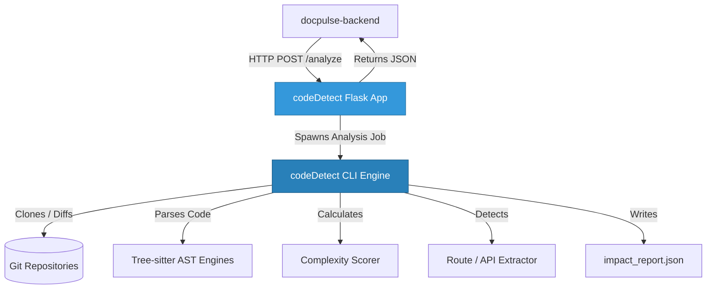
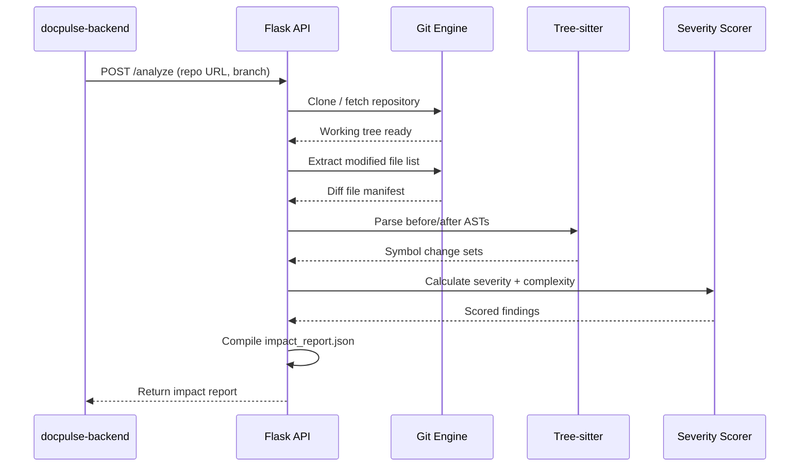
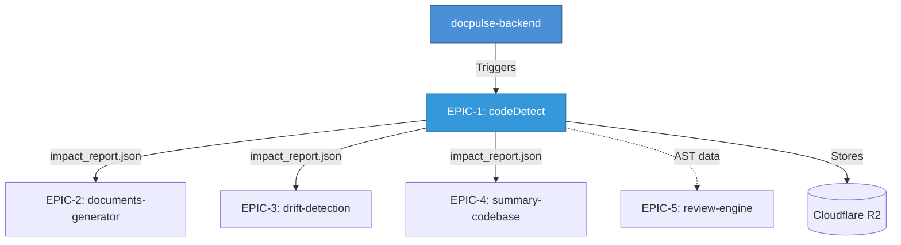

<div align="center">

# codeDetect

**AST Code Intelligence Engine**

[](https://www.python.org/downloads/release/python-3110/)
[](https://flask.palletsprojects.com/)
[](https://tree-sitter.github.io/tree-sitter/)
[](https://gitpython.readthedocs.io/)
[](https://github.com/features/actions)
[](Dockerfile)

*Part of the [DocPulseAI](https://github.com/DocPulseAI) ecosystem — **EPIC-1: Code Intelligence***

---

**codeDetect** is a production-grade Python AST code intelligence service that analyzes codebases using Git diffs and Tree-sitter parsing to generate deep impact reports. It detects affected classes, functions, complexity changes, and breaking API updates — serving as the foundational data source for the entire DocPulseAI documentation pipeline.

</div>

---

## Table of Contents

- [Purpose](#purpose)
- [Responsibilities](#responsibilities)
- [Architecture Overview](#architecture-overview)
- [Technology Stack](#technology-stack)
- [Directory Structure](#directory-structure)
- [Environment Variables](#environment-variables)
- [Installation](#installation)
- [Local Development](#local-development)
- [Testing](#testing)
- [Docker](#docker)
- [CI/CD](#cicd)
- [Integration with DocPulseAI](#integration-with-docpulseai)
- [Deployment](#deployment)
- [Troubleshooting](#troubleshooting)
- [Roadmap](#roadmap)
- [Contributing](#contributing)

---

## Purpose

- **Business Purpose**: Enable developers and managers to understand the functional impact of their commits by automatically calculating complexity, identifying affected files and code symbols, and highlighting breaking API changes.
- **Technical Purpose**: Parse code syntax trees (ASTs) of commits across Git checkouts, evaluate complexity indices, detect changes to classes/functions/routes, assign change severity (PATCH, MINOR, MAJOR), and serve these reports via REST HTTP endpoints.

---

## Responsibilities

| Domain | Description |
|---|---|
| **AST Parsing** | Compute syntax tree representations of Python, Java, and JavaScript/TypeScript source files to detect exact code change ranges. |
| **Git Analysis** | Clone remote repositories, inspect branch diffs, track renamed files, and extract commit meta-details (author, timestamp, messages). |
| **Severity Scoring** | Analyze symbol change types (deleted parameters, signature changes) to flag breaking changes and calculate severity. |
| **Complexity Measurement** | Compute Cyclomatic complexity diffs between old and new versions of modified functions. |
| **Dependency Diagnostics** | Expose detailed health probes checking Tree-sitter parser compatibility and subprocess memory pool levels. |

---

## Architecture Overview

`codeDetect` operates as an independent microservice written in Python. It can run in CLI mode or as a Flask HTTP API server:



### Analysis Lifecycle



1. **Repository Fetch**: GitPython clones or fetches updates from the target URL/branch.
2. **Git Diffing**: Extracts a list of modified, added, and deleted files.
3. **AST Parsing**: Analyzes modified files. Compares "before" and "after" syntax trees to extract changed symbols (methods, parameters, routes).
4. **Scoring**: Calculates Cyclomatic complexity differences and detects signature changes to assign a severity level.
5. **Output**: Exports a structured `impact_report.json` containing metadata, file summaries, and symbol modifications.

---

## Technology Stack

| Category | Technology | Version | Purpose |
|---|---|---|---|
| **Runtime** | Python | 3.11+ | Core runtime |
| **HTTP Server** | Flask + Gunicorn | 3.1.0 / 21.2.0 | REST API serving |
| **Syntax Parsing** | Tree-sitter + Languages | 0.21.3 / 1.10.2 | Multi-language AST analysis |
| **Git** | GitPython | 3.1.43 | Repository cloning and diff computation |
| **Validation** | Pydantic + JSONSchema | 2.0+ / 4.23.0 | Schema validation for inputs and reports |
| **API Docs** | Flasgger | 0.9.7.1 | Swagger UI documentation |
| **Testing** | Pytest + Pytest-Cov | 8.3.4 / 6.0.0 | Unit and integration testing with coverage |

---

## Directory Structure

```
code-intelligence/codeDetect/
├── pipeline/               # Custom data ingestion pipelines
├── queries/                # Tree-sitter query files for language symbol matching
├── schemas/                # Pydantic schemas validating inputs and reports
├── services/               # Core domain engines (Git fetchers, parser agents)
├── src/                    # Code analysis components
│   ├── intelligence/       # Complex analytics: route checkers, call graphs
│   └── syntax_checker.py   # Code grammar validator
├── tests/                  # Pytest unit and integration test scripts
├── worker/                 # Optional background task worker implementations
├── api.py                  # Flask HTTP API server entrypoint
├── main.py                 # Command Line Interface (CLI) runner
├── gunicorn.conf.py        # Gunicorn production configuration
├── requirements.txt        # Python dependency manifest
├── Dockerfile              # Container definition
├── docker-compose.yml      # Local multi-service orchestrator
└── service.yaml            # Render deploy configuration
```

---

## Environment Variables

| Variable | Purpose | Required | Default |
|---|---|---|---|
| `PORT` | Local server port | No | `5000` |
| `GITHUB_TOKEN` | Token for reading private repos | No | — |
| `EPIC1_LOG_BODY_MAX_CHARS` | Size cap of stderr previews in server logs | No | `1200` |
| `LOG_LEVEL` | Logging granularity | No | `INFO` |

---

## Installation

### Prerequisites

- Python 3.11.x
- Git command-line installed and added to system PATH

### Setup

```bash
# Navigate to the codeDetect directory
cd code-intelligence/codeDetect

# Create and activate virtual environment
python -m venv .venv
source .venv/bin/activate

# Install dependencies
pip install --upgrade pip
pip install -r requirements.txt
```

---

## Local Development

### Run HTTP Service (Flask)

```bash
python api.py
```

Open [http://localhost:5000/apidocs/](http://localhost:5000/apidocs/) for the Swagger API Documentation.

### Run in CLI Mode

```bash
# Local repository analysis
python main.py /path/to/local/repo

# Remote repository analysis
export GITHUB_TOKEN="your_personal_token"
python main.py https://github.com/owner/repo main
```

This generates `impact_report.json` in the current directory.

---

## Testing

```bash
# Run all tests
PYTHONPATH=. pytest tests/

# Run with coverage
PYTHONPATH=. pytest --cov=src --cov-report=term-missing
```

---

## Docker

```bash
# Build image
docker build -t codedetect -f Dockerfile .

# Run container
docker run -p 5000:5000 --env GITHUB_TOKEN="ghp_xxx" codedetect
```

---

## CI/CD


| Workflow | Trigger | Purpose |
|---|---|---|
| `ci.yml` | Push / PR | Lint, unit tests, coverage enforcement |
| `security.yml` | Push / PR | Dependency vulnerability scanning |

---

## Integration with DocPulseAI

codeDetect is the **foundation** of the DocPulseAI pipeline — every downstream EPIC depends on its output:



| Consumer | Data Used | Purpose |
|---|---|---|
| **EPIC-2 (documents-generator)** | `impact_report.json` | Uses symbol changes, complexity diffs, and file metadata to generate structured documentation. |
| **EPIC-3 (drift-detection)** | `impact_report.json` | Compares changed symbols against documentation snapshots to detect drift. |
| **EPIC-4 (summary-codebase)** | `impact_report.json` | Extracts severity scores and breaking changes for human-readable summaries. |
| **EPIC-5 (review-engine)** | AST data + diffs | Provides function-level change context for agent-based code review. |

---

## Deployment

Deployable via **Render** (configured via `service.yaml`) or any Docker-compatible hosting platform.

- **Dependency Health**: Endpoint `/health/dependencies` verifies Tree-sitter compilers and virtual memory pools.
- **Git Client**: Git is installed within the Docker runtime to support GitPython operations.

---

## Troubleshooting

### Degraded Health Check (`/health/dependencies` returns 503)
- **Symptom**: Dependency health endpoint returns errors or 503.
- **Solution**: Confirm that the Python environment includes `tree-sitter` libraries and that compilers have write permissions to cache files.

### Repository Clone Failures
- **Symptom**: Server reports `Repository clone timed out` or `Access denied`.
- **Solution**: Verify `GITHUB_TOKEN` is loaded correctly. For public repos, ensure network access is not blocked by proxies.

### Symbol Extraction Issues
- **Symptom**: Analysis succeeds but returns empty class/function listings.
- **Solution**: Verify file extensions are `.py`, `.java`, or `.js`/`.ts`. Unsupported languages default to text-diff analysis without syntax symbol extraction.

---

## Roadmap

| Phase | Feature | Status |
|---|---|---|
| **v1.0** | Python, Java, JavaScript/TypeScript AST parsing | ✅ Complete |
| **v1.0** | Git diff analysis with severity scoring | ✅ Complete |
| **v1.0** | Flask API with Swagger documentation | ✅ Complete |
| **v1.1** | Route and API endpoint detection | ✅ Complete |
| **v1.1** | Call graph analysis | 🔨 In Progress |
| **v1.2** | Go and Rust language support | 📋 Planned |
| **v1.2** | Incremental analysis (cached AST trees) | 📋 Planned |
| **v2.0** | Real-time file watcher mode | 📋 Planned |
| **v2.0** | Semantic similarity matching for renamed symbols | 📋 Planned |

---

## Contributing

1. Code additions must be fully typed using Python type hints.
2. Maintain standard coverage parameters (configured in `.coveragerc`) at or above 70% during test runs.
3. Validate schemas with `schemas/` before committing parser modifications.
