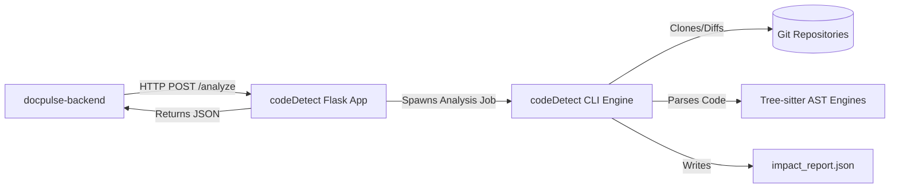

# codeDetect

Production-grade Python AST code intelligence service. It acts as **EPIC-1** in the DocPulseAI pipeline, analyzing codebases using Git diffs and Tree-sitter parsing to generate deep impact reports containing affected classes, functions, complexity changes, and breaking API updates.

## Purpose
- **Business Purpose**: Enable developers and managers to understand the functional impact of their commits by automatically calculating complexity, identifying affected files and code symbols, and highlighting breaking API changes.
- **Technical Purpose**: Parse code syntax trees (ASTs) of commits across Git checkouts, evaluate complexity indices, detect changes to classes/functions/routes, assign change severity (PATCH, MINOR, MAJOR), and serve these reports via REST HTTP endpoints.

## Responsibilities
- **AST Parsing**: Compute syntax tree representations of Python, Java, and JavaScript/TypeScript source files to detect exact code change ranges.
- **Git Analysis**: Clone remote repositories, inspect branch diffs, track renamed files, and extract commit meta-details (author, timestamp, messages).
- **Severity Scoring**: Analyze symbol change types (e.g., deleted function parameter, signature change) to flag breaking changes and calculate severity.
- **Dependency Diagnostics**: Expose detailed health probes checking tree-sitter parser compatibility and subprocess memory pool levels.

## Architecture Overview
`codeDetect` operates as an independent microservice written in Python. It can run in CLI mode or as a Flask HTTP API server:



### Analysis Lifecycle:
1. **Repository Fetch**: GitPython clones or fetches updates from the target URL/branch.
2. **Git Diffing**: Extracts a list of modified, added, and deleted files.
3. **AST Parsing**: Analyzes modified files. Compares "before" and "after" syntax trees to extract changed symbols (methods, parameters, routes).
4. **Scoring**: Calculates Cyclomatic complexity differences and detects signature changes to assign a severity level.
5. **Output**: Exports a structured `impact_report.json` containing metadata, file summaries, and symbol modifications.

---

## Technology Stack
- **Runtime**: Python 3.11+
- **HTTP Server**: Flask (v3.1.0) + Gunicorn (v21.2.0)
- **Syntax Parsing**: Tree-sitter (v0.21.3) + Tree-sitter Languages (v1.10.2)
- **Git Hook**: GitPython (v3.1.43)
- **Schema Validation**: Pydantic (v2.0+) & JSONSchema (v4.23.0)
- **APIs Docs**: Flasgger (v0.9.7.1) for Swagger UI
- **Testing**: Pytest (v8.3.4) + Pytest-Cov (v6.0.0)

---

## Directory Structure
```
code-intelligence/codeDetect/
├── pipeline/               # Custom data ingestion pipelines
├── queries/                # Tree-sitter query files for language symbol matching
├── schemas/                # Pydantic schemas validating inputs and reports
├── services/               # Core domain engines (Git fetchers, parser agents)
├── src/                    # Code analysis components
│   ├── intelligence/       # Complex analytics: route checkers, call graphs
│   └── syntax_checker.py   # Code grammar validator
├── tests/                  # Pytest unit and integration test scripts
├── worker/                 # Optional background task worker implementations
├── api.py                  # Flask HTTP API server entrypoint
├── main.py                 # Command Line Interface (CLI) runner
├── requirements.txt        # Python dependency manifest
├── Dockerfile              # Container definition
├── docker-compose.yml      # Local multi-service orchestrator
└── service.yaml            # Render deploy configuration
```

---

## Environment Variables

| Variable Name | Purpose | Required? | Default / Example |
|---|---|---|---|
| `PORT` | Local server port | No | `5000` |
| `GITHUB_TOKEN` | Token for reading private repos | No | `ghp_yourpersonaltoken` |
| `EPIC1_LOG_BODY_MAX_CHARS` | Size cap of stderr previews in server logs | No | `1200` |
| `LOG_LEVEL` | Level of logging granularity | No | `INFO` / `DEBUG` |

---

## Installation

### Prerequisites
- Python 3.11.x
- Git command-line installed and added to host system PATH

### Setup Steps
1. Navigate to the codeDetect directory:
   ```bash
   cd code-intelligence/codeDetect
   ```
2. Create and activate a Python virtual environment:
   ```bash
   python -m venv .venv
   source .venv/bin/activate
   ```
3. Install the dependencies:
   ```bash
   pip install --upgrade pip
   pip install -r requirements.txt
   ```

---

## Local Development

### Run HTTP Service (Flask)
Start the service on port `5000`:
```bash
python api.py
```
Open [http://localhost:5000/apidocs/](http://localhost:5000/apidocs/) in your browser to view the Swagger API Documentation.

### Run in CLI Mode
Analyze a local or remote repository directly from the console:
```bash
# Local analysis
python main.py /path/to/local/repo

# Remote analysis
export GITHUB_TOKEN="your_personal_token"
python main.py https://github.com/owner/repo main
```
This generates the file `impact_report.json` in the current directory.

---

## Testing

Run tests and display the summary:
```bash
PYTHONPATH=. pytest tests/
```

Run tests with coverage tracking:
```bash
PYTHONPATH=. pytest --cov=src --cov-report=term-missing
```

---

## Docker

### Build Image
```bash
docker build -t codedetect -f Dockerfile .
```

### Run Container
```bash
docker run -p 5000:5000 --env GITHUB_TOKEN="ghp_xxx" codedetect
```

---

## Deployment

Deployable directly via **Render** (configured via `service.yaml`) or on **Azure Container Apps**.

- **Dependency Health**: The endpoint `/health/dependencies` is available to verify Tree-sitter compilers and virtual memory pools.
- **Git Client**: Git command line is installed within the Docker runtime (`Dockerfile`) to support GitPython operations.

---

## Troubleshooting

### degraded health check (`/health/dependencies` returns 503)
- **Symptom**: Dependency health endpoint returns errors or exits with 503.
- **Solution**: Confirm that Python virtual environment includes `tree-sitter` libraries and that compilers have write permissions to cache files.

### Repository Clone Failures
- **Symptom**: Server reports `Repository clone timed out` or `Access denied`.
- **Solution**: Verify `GITHUB_TOKEN` is loaded correctly. If cloning public repositories, make sure network access is not blocked by proxies.

### Symbol Extraction Issues
- **Symptom**: Analysis succeeds, but returns empty class/function listings.
- **Solution**: Verify the file extensions are `.py`, `.java`, or `.js`/`.ts`. Unsupported languages will default to simple text-diff analysis and will not extract syntax symbols.

---

## Contributing
1. Code additions must be fully typed using Python type hints.
2. Maintain standard coverage parameters (configured in `.coveragerc`) at or above 70% during test runs.
3. Validate schemas with `schemas/` before committing parser modifications.
